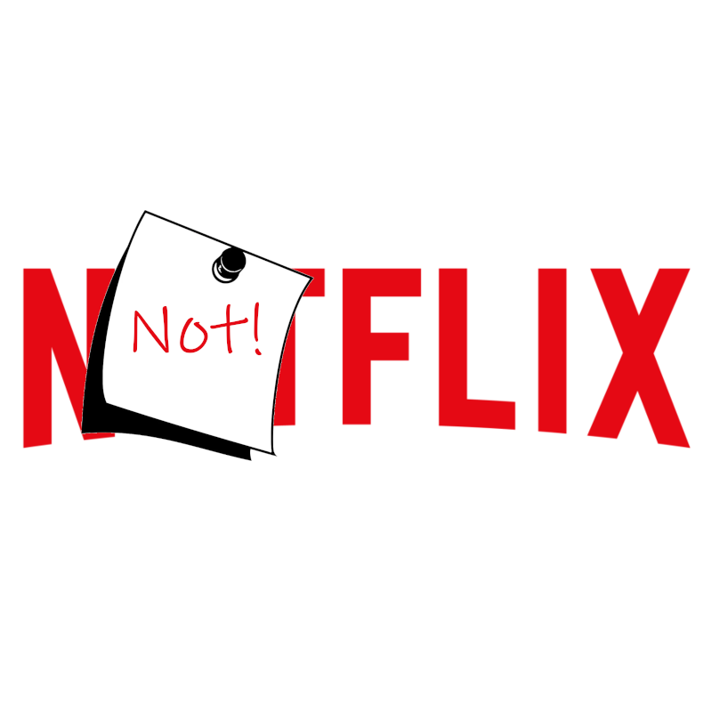
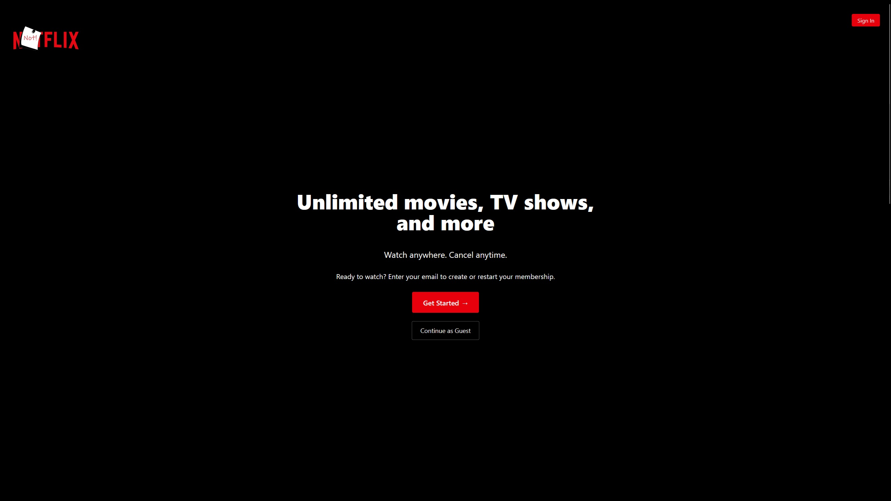
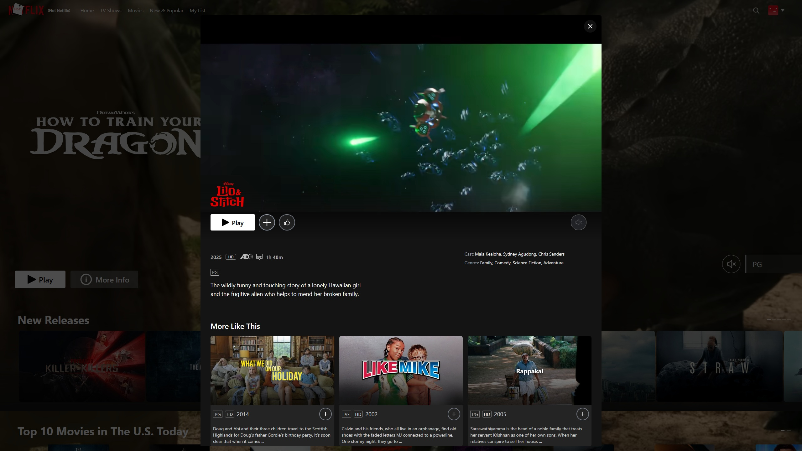
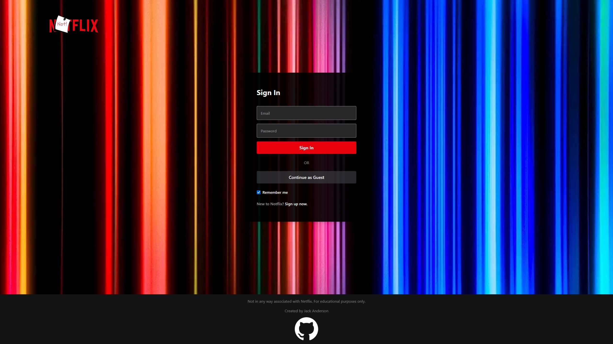
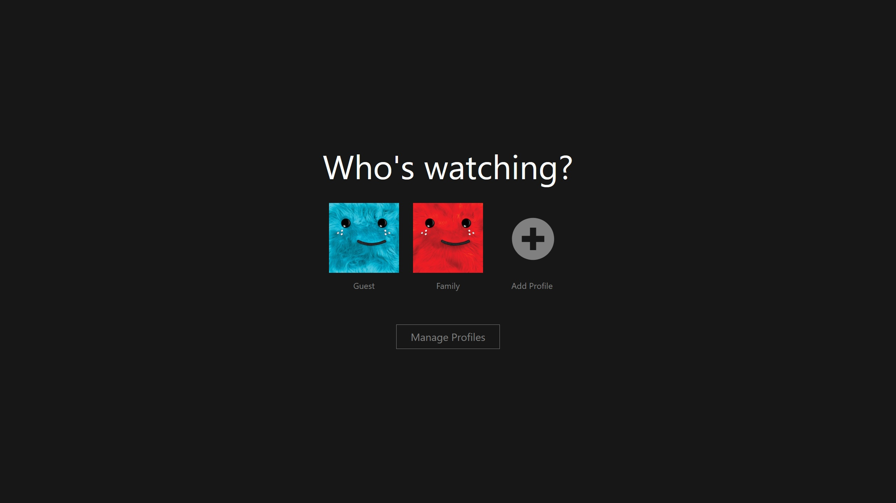
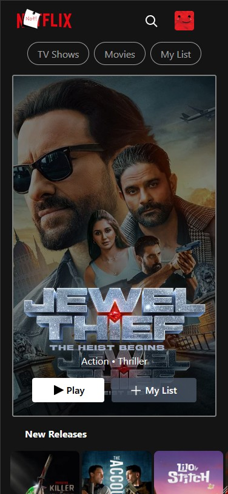
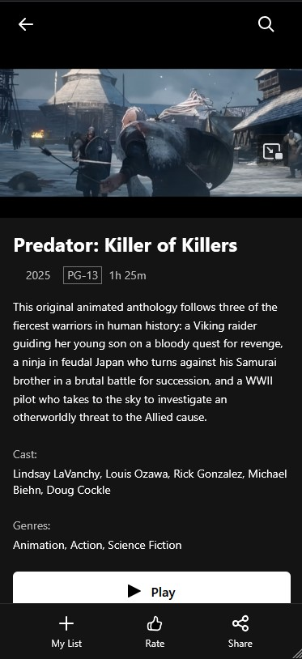

<!-- Improved compatibility of back to top link: See: https://github.com/othneildrew/Best-README-Template/pull/73 -->

<a id="readme-top"></a>

<!--
*** Thanks for checking out the Best-README-Template. If you have a suggestion
*** that would make this better, please fork the repo and create a pull request
*** or simply open an issue with the tag "enhancement".
*** Don't forget to give the project a star!
*** Thanks again! Now go create something AMAZING! :D
-->

<!-- PROJECT SHIELDS -->
<!--
*** I'm using markdown "reference style" links for readability.
*** Reference links are enclosed in brackets [ ] instead of parentheses ( ).
*** See the bottom of this document for the declaration of the reference variables
*** for contributors-url, forks-url, etc. This is an optional, concise syntax you may use.
*** https://www.markdownguide.org/basic-syntax/#reference-style-links
-->


[![LinkedIn][linkedin-shield]][linkedin-url]

<!-- PROJECT LOGO -->
<br />
<div align="center">
  <a href="https://github.com/jack123xyz/notflix">
    
  </a>

  <h3 align="center">Notflix</h3>

  <p align="center">
    A Fully Responsive Netflix Clone
    <br />
    <a href="https://github.com/jack123xyz/notflix"><strong>Explore the docs »</strong></a>
    <br />
    <br />
    <a href="https://notflix.jack123.xyz/">View Demo</a>
    ·
    <a href="https://github.com/jack123xyz/notflix/issues/new/choose">Report Bug</a>
    ·
    <a href="https://github.com/jack123xyz/notflix/issues/new/choose">Request Feature</a>
  </p>
</div>

<!-- TABLE OF CONTENTS -->
<details>
  <summary>Table of Contents</summary>
  <ol>
    <li>
      <a href="#about-the-project">About The Project</a>
      <ul>
        <li><a href="#built-with">Built With</a></li>
      </ul>
    </li>
    <li>
      <a href="#getting-started">Getting Started</a>
      <ul>
        <li><a href="#prerequisites">Prerequisites</a></li>
        <li><a href="#installation">Installation</a></li>
      </ul>
    </li>
    <li><a href="#license">License</a></li>
    <li><a href="#contact">Contact</a></li>
    
  </ol>
</details>

<!-- ABOUT THE PROJECT -->

## About The Project

[![Home Page Screen Shot][product-screenshot]](./readme_assets/images/Project-Screenshot.jpg)

Notflix is a responsive Netflix clone that was born from a desire to master the Vue.js framework. The project was breaking new ground for me, building a modern single-page application (SPA), as a departure from my experience building multi-page e-commerce websites.
<br></br>
The application was built from scratch over approximately two and a half months, with a primary focus on replicating the polished user interface of Netflix. It is developed with Vite for a fast and modern workflow and is deployed on my Linux server using Apache. I hope you enjoy exploring it.

<p align="right">(<a href="#readme-top">back to top</a>)</p>

### Built With

- [![Vue][Vue.js]][Vue-url]
- [![Vite][Vite.dev]][Vite-url]
- [![Tailwind][Tailwindcss.com]][Tailwind-url]
- [![TMDB][themoviedatabase.com]][TMDB-url]
- [![Pinia][PiniaStore]][Pinia-url]
- [![Firebase][Firebase.google.com]][Firebase-url]
- [![Vue Router][VueRouter]][Router-url]
- [![Node.js][Node.js]][Node.js-url]

<p align="right">(<a href="#readme-top">back to top</a>)</p>

<!-- GETTING STARTED -->

## Getting Started

To get Notflix running on your local machine, follow these steps:

### Prerequisites

- Node.js (v16 or later)
- npm (v7 or later)
- A TMDB API key
- A Firebase project

### Installation

1. Get a free API Key from [TMDB](https://www.themoviedb.org/settings/api)

2. Create a Firebase project at [Firebase Console](https://console.firebase.google.com/)

   - Enable Authentication with Email/Password provider
   - Set up Firestore Database
   - Get your Firebase configuration from Project Settings

3. Clone the repository
   ```sh
   git clone https://github.com/jack123xyz/notflix.git
   ```
4. Install NPM packages
   ```sh
   npm install
   ```
5. Create a `.env.local` file in the root directory with your API key

   ```js
   VITE_TMDB_API_KEY = your_tmdb_api_key;
   ```

   ## Firebase Setup

After cloning the repository, you'll need to set up your own Firebase project:

1. **Create a Firebase Project**:

   - Go to [Firebase Console](https://console.firebase.google.com/)
   - Click "Add project" and follow the setup wizard
   - Give your project a name (e.g., "notflix-clone")
   - Choose whether to enable Google Analytics (optional)
   - Click "Create project"

2. **Configure Authentication**:

   - In your Firebase project, go to "Authentication" from the left sidebar
   - Click "Get started"
   - Enable the "Email/Password" sign-in method
   - Save your changes

3. **Set up Firestore Database**:

   - Go to "Firestore Database" in the left sidebar
   - Click "Create database"
   - Choose "Start in test mode" for development (you can change this later)
   - Select a location close to your users
   - Click "Enable"

4. **Get your Firebase configuration**:

   - Go to Project Settings (gear icon in the top left)
   - Scroll down to "Your apps" section
   - Click the Web icon (</>) to add a web app
   - Register the app with a nickname (e.g., "notflix-web")
   - Copy the `firebaseConfig` object that appears

5. **Update the Firebase configuration in the project**:

   - Create a file at `src/firebase.js` with the following content:

   ```javascript
   // src/firebase.js
   import { initializeApp } from "firebase/app";
   import { getAuth } from "firebase/auth";
   import { getFirestore } from "firebase/firestore";

   const firebaseConfig = {
     apiKey: "YOUR_API_KEY",
     authDomain: "YOUR_PROJECT_ID.firebaseapp.com",
     projectId: "YOUR_PROJECT_ID",
     storageBucket: "YOUR_PROJECT_ID.appspot.com",
     messagingSenderId: "YOUR_MESSAGING_SENDER_ID",
     appId: "YOUR_APP_ID",
   };

   // Replace the placeholder values with your Firebase configuration values

   const app = initializeApp(firebaseConfig);
   const auth = getAuth(app);
   const db = getFirestore(app);

   export { auth, db };
   ```

6. Start the development server
   ```sh
   npm run dev
   ```

<p align="right">(<a href="#readme-top">back to top</a>)</p>

<!-- USAGE EXAMPLES -->

## Screenshots

**Home.vue**
![![Home Page Screen Shot][product-screenshot]](./readme_assets/images/Project-Screenshot.jpg)
<br/>

**Landing.vue**

<br/>

**ContentModal.vue**

<br/>

**Login.vue**

<br/>

**SelectProfile.vue**

<br/>

**Mobile Home Page**
<br/>


<br/>

**Mobile Details View**
<br/>


<br/>

<p align="right">(<a href="#readme-top">back to top</a>)</p>

<!-- ROADMAP -->

## Features

- [x] Responsive design adapting to desktop and mobile views
- [x] Interactive UI Carousels built with Swiper.js
- [x] Dynamic content delivery fetched from TMDB API
- [x] Interactive Modals for detailed content information, suggestions, and episode lists
- [x] Component-based structure leverages Vue.js for modular UI elements (Navbar, Footer, Content Grids/Carousels, Modals, etc.)
- [x] Utilizes Pinia for global state management (user data, movie/TV genres, etc.)
- [x] Client side routing between sections using Vue Router
- [x] Tailwind CSS styling

<p align="right">(<a href="#readme-top">back to top</a>)</p>

<!-- LICENSE -->

## License

[MIT](https://github.com/jack123xyz/notflix/blob/main/LICENSE)

<p align="right">(<a href="#readme-top">back to top</a>)</p>

<!-- CONTACT -->

## Contact

Jack Anderson - [Linked In](https://www.linkedin.com/in/jack-anderson-52bb78369/) - jackanderson1302000@gmail.com

<p align="right">(<a href="#readme-top">back to top</a>)</p>

<!-- MARKDOWN LINKS & IMAGES -->
<!-- https://www.markdownguide.org/basic-syntax/#reference-style-links -->

[contributors-shield]: https://img.shields.io/github/contributors/github_username/repo_name.svg?style=for-the-badge
[contributors-url]: https://github.com/github_username/repo_name/graphs/contributors
[forks-shield]: https://img.shields.io/github/forks/github_username/repo_name.svg?style=for-the-badge
[forks-url]: https://github.com/github.com/jack123xyz/notflix/network/members
[stars-shield]: https://img.shields.io/github/stars/github.com/jack123xyz/notflix.svg?style=for-the-badge
[stars-url]: https://github.com/jack123xyz/notflix/stargazers
[issues-shield]: https://img.shields.io/github/issues/github_username/repo_name.svg?style=for-the-badge
[issues-url]: https://github.com/jack123xyz/notflix/issues
[license-shield]: https://img.shields.io/github/license/github_username/repo_name.svg?style=for-the-badge
[license-url]: https://github.com/github_username/repo_name/blob/master/LICENSE.txt
[linkedin-shield]: https://img.shields.io/badge/-LinkedIn-black.svg?style=for-the-badge&logo=linkedin&colorB=555
[linkedin-url]: https://www.linkedin.com/in/jack-anderson-52bb78369/
[product-screenshot]: ./readme_assets/images/Project-Screenshot.jpg
[Next.js]: https://img.shields.io/badge/next.js-000000?style=for-the-badge&logo=nextdotjs&logoColor=white
[Next-url]: https://nextjs.org/
[React.js]: https://img.shields.io/badge/React-20232A?style=for-the-badge&logo=react&logoColor=61DAFB
[React-url]: https://reactjs.org/
[Vue.js]: https://img.shields.io/badge/Vue.js-35495E?style=for-the-badge&logo=vuedotjs&logoColor=4FC08D
[Vue-url]: https://vuejs.org/
[Angular.io]: https://img.shields.io/badge/Angular-DD0031?style=for-the-badge&logo=angular&logoColor=white
[Angular-url]: https://angular.io/
[Svelte.dev]: https://img.shields.io/badge/Svelte-4A4A55?style=for-the-badge&logo=svelte&logoColor=FF3E00
[Svelte-url]: https://svelte.dev/
[Laravel.com]: https://img.shields.io/badge/Laravel-FF2D20?style=for-the-badge&logo=laravel&logoColor=white
[Laravel-url]: https://laravel.com
[Bootstrap.com]: https://img.shields.io/badge/Bootstrap-563D7C?style=for-the-badge&logo=bootstrap&logoColor=white
[Bootstrap-url]: https://getbootstrap.com
[JQuery.com]: https://img.shields.io/badge/jQuery-0769AD?style=for-the-badge&logo=jquery&logoColor=white
[JQuery-url]: https://jquery.com
[Vite.dev]: https://img.shields.io/badge/Vite-646CFF?style=for-the-badge&logo=Vite&logoColor=white
[Vite-url]: https://vite.dev/
[Apache-url]: https://www.apache.org/
[PiniaStore]: https://img.shields.io/badge/Pinia-3.0-303643?style=for-the-badge&labelColor=FFDB5C
[Pinia-url]: https://pinia.vuejs.org/
[Router-url]: https://router.vuejs.org/
[VueRouter]: https://img.shields.io/badge/vue--router-%404-brightgreen?style=for-the-badge
[Node.js-url]: https://nodejs.org/en
[Node.js]: https://img.shields.io/badge/node.js-339933?style=for-the-badge&logo=Node.js&logoColor=white
[Firebase-url]: https://firebase.google.com/
[Firebase.google.com]: https://img.shields.io/badge/firebase-ffca28?style=for-the-badge&logo=firebase&logoColor=black
[Tailwind-url]: https://tailwindcss.com/
[Tailwindcss.com]: https://img.shields.io/badge/tailwindcss-0F172A?style=for-the-badge&logo=tailwindcss
[TMDB-url]: https://www.themoviedb.org/?language=en-US
[themoviedatabase.com]: https://img.shields.io/badge/TMDB-555555?style=for-the-badge&logo=themoviedatabase&logoColor=01D277
